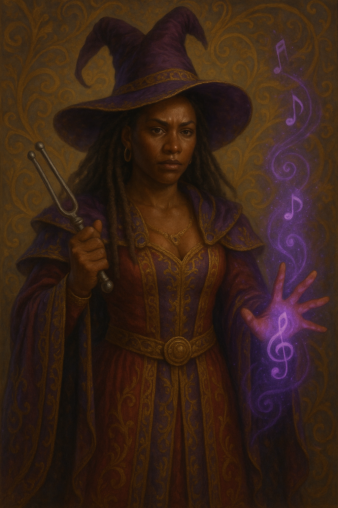

# Lasoundra

## Classification

- Native
- Legendary Wizard
- Witch

## Veiled Form

- A music theory app exploring musical structure and notation ideas. See the [Lasoundra README](https://github.com/Noswad123/lasoundra/blob/main/README.md).

## Arcane Form

- A witch whose role in the larger canon is still emerging.

## Domains

- Witchcraft
- Music theory

## Relationships

- May belong to, found, or oppose a [Coven](./coven.md).

## Lore Notes

- A witch.
